# 🧠 AI Karar Verme Süreci - Decision Tree

Bu dokümantasyon, MCP Ecosystem Platform'daki AI'ın nasıl karar verdiğini, hangi faktörleri değerlendirdiğini ve hangi eylemleri önerdiğini detaylı olarak açıklar.

## 📋 İçindekiler

- [Genel Karar Verme Süreci](#genel-karar-verme-süreci)
- [Risk Değerlendirme Matrisi](#risk-değerlendirme-matrisi)
- [MCP Sunucu Karar Ağacı](#mcp-sunucu-karar-ağacı)
- [Sistem Kaynak Karar Ağacı](#sistem-kaynak-karar-ağacı)
- [Veritabanı Karar Ağacı](#veritabanı-karar-ağacı)
- [Pattern Detection Logic](#pattern-detection-logic)
- [Approval Workflow Logic](#approval-workflow-logic)

## 🌟 Genel Karar Verme Süreci

AI'ın karar verme süreci şu aşamalardan oluşur:

```mermaid
graph TD
    A[Sistem Durumu Toplama] --> B[Veri Analizi]
    B --> C[Problem Tespiti]
    C --> D[Risk Değerlendirmesi]
    D --> E[Çözüm Önerisi]
    E --> F[Güvenlik Kontrolü]
    F --> G{Onay Gerekli?}
    G -->|Evet| H[Onay Bekle]
    G -->|Hayır| I[Eylemi Uygula]
    H --> J[Kullanıcı Onayı]
    J --> I
    I --> K[Sonuç Doğrulama]
    K --> L[Öğrenme ve Adaptasyon]
```



### 1. 📊 Veri Toplama Aşaması

AI şu veri kaynaklarından bilgi toplar:

```python
data_sources = {
    "mcp_servers": {
        "status": ["HEALTHY", "DEGRADED", "OFFLINE", "STARTING"],
        "response_time": "milliseconds",
        "uptime_percentage": "0-100",
        "error_count": "integer",
        "last_heartbeat": "timestamp"
    },
    "system_resources": {
        "cpu_percent": "0-100",
        "memory_percent": "0-100", 
        "disk_percent": "0-100",
        "process_count": "integer",
        "load_average": "[1min, 5min, 15min]"
    },
    "database": {
        "latency_ms": "milliseconds",
        "connection_pool_active": "integer",
        "slow_queries": "integer"
    },
    "historical_data": {
        "failure_patterns": "array",
        "performance_trends": "array",
        "resolution_success_rate": "percentage"
    }
}
```

### 2. 🔍 Problem Tespit Algoritması

```python
def detect_problems(system_data):
    problems = []
    
    # MCP Server Problems
    for server, status in system_data.mcp_servers.items():
        if status.status == "OFFLINE":
            problems.append({
                "type": "server_offline",
                "severity": "high",
                "component": server,
                "confidence": 0.95
            })
        elif status.response_time > 500:
            problems.append({
                "type": "performance_degradation", 
                "severity": "medium",
                "component": server,
                "confidence": 0.8
            })
    
    # Resource Problems
    if system_data.cpu_percent > 85:
        problems.append({
            "type": "high_cpu",
            "severity": "medium",
            "confidence": 0.9
        })
    
    return problems
```

## 🎯 Risk Değerlendirme Matrisi

AI, her eylem için risk seviyesini şu faktörlere göre belirler:

| Faktör | SAFE | LOW | MEDIUM | HIGH | CRITICAL |
|--------|------|-----|--------|------|----------|
| **Sistem Etkisi** | Sadece okuma | Tek bileşen | Birden fazla bileşen | Tüm sistem | Kritik altyapı |
| **Geri Alınabilirlik** | N/A | Kolay | Orta | Zor | İmkansız |
| **Downtime Riski** | Yok | <1 dk | 1-5 dk | 5-15 dk | >15 dk |
| **Veri Kaybı Riski** | Yok | Yok | Minimal | Orta | Yüksek |
| **Kullanıcı Etkisi** | Yok | Minimal | Orta | Yüksek | Kritik |

### Risk Hesaplama Algoritması

```python
def calculate_risk_level(action, context):
    risk_factors = {
        "system_impact": get_system_impact(action),
        "reversibility": get_reversibility(action),
        "downtime_risk": get_downtime_risk(action),
        "data_loss_risk": get_data_loss_risk(action),
        "user_impact": get_user_impact(action, context)
    }
    
    # Weighted risk calculation
    weights = {
        "system_impact": 0.3,
        "reversibility": 0.2,
        "downtime_risk": 0.25,
        "data_loss_risk": 0.15,
        "user_impact": 0.1
    }
    
    total_risk = sum(
        risk_factors[factor] * weights[factor] 
        for factor in risk_factors
    )
    
    if total_risk < 0.2: return "SAFE"
    elif total_risk < 0.4: return "LOW"
    elif total_risk < 0.6: return "MEDIUM"
    elif total_risk < 0.8: return "HIGH"
    else: return "CRITICAL"
```

## 🖥️ MCP Sunucu Karar Ağacı


### MCP Server Decision Logic

```python
def decide_mcp_server_action(server_name, status, metrics):
    decision = {
        "action": None,
        "risk_level": "SAFE",
        "reasoning": "",
        "confidence": 0.0
    }
    
    if status.status == "OFFLINE":
        if status.error_message and "connection refused" in status.error_message.lower():
            decision.update({
                "action": "mcp_server_restart",
                "risk_level": "HIGH",
                "reasoning": "Server process appears to be down",
                "confidence": 0.9
            })
        else:
            decision.update({
                "action": "investigate_processes",
                "risk_level": "LOW", 
                "reasoning": "Need to diagnose connection issue",
                "confidence": 0.7
            })
    
    elif status.status == "DEGRADED":
        if status.response_time > 1000:
            decision.update({
                "action": "mcp_server_restart",
                "risk_level": "MEDIUM",
                "reasoning": "Severe performance degradation detected",
                "confidence": 0.8
            })
        else:
            decision.update({
                "action": "investigate_processes",
                "risk_level": "LOW",
                "reasoning": "Performance optimization needed",
                "confidence": 0.6
            })
    
    elif status.status == "HEALTHY":
        if status.response_time > 500:
            decision.update({
                "action": "investigate_processes",
                "risk_level": "SAFE",
                "reasoning": "Preventive performance check",
                "confidence": 0.5
            })
    
    return decision
```

## 📊 Sistem Kaynak Karar Ağacı


### Resource Decision Logic

```python
def decide_resource_action(cpu_percent, memory_percent, disk_percent):
    actions = []
    
    # CPU Decision
    if cpu_percent > 90:
        actions.append({
            "action": "restart_services",
            "risk_level": "MEDIUM",
            "reasoning": f"Critical CPU usage: {cpu_percent}%",
            "priority": "urgent",
            "confidence": 0.85
        })
    elif cpu_percent > 85:
        actions.append({
            "action": "investigate_processes", 
            "risk_level": "LOW",
            "reasoning": f"High CPU usage: {cpu_percent}%",
            "priority": "high",
            "confidence": 0.9
        })
    
    # Memory Decision
    if memory_percent > 95:
        actions.append({
            "action": "restart_services",
            "risk_level": "HIGH",
            "reasoning": f"Critical memory usage: {memory_percent}%",
            "priority": "urgent", 
            "confidence": 0.95
        })
    elif memory_percent > 85:
        actions.append({
            "action": "memory_cleanup",
            "risk_level": "LOW",
            "reasoning": f"High memory usage: {memory_percent}%",
            "priority": "medium",
            "confidence": 0.8
        })
    
    # Disk Decision
    if disk_percent > 98:
        actions.append({
            "action": "emergency_cleanup",
            "risk_level": "CRITICAL",
            "reasoning": f"Critical disk space: {disk_percent}%",
            "priority": "urgent",
            "confidence": 0.99
        })
    elif disk_percent > 90:
        actions.append({
            "action": "cleanup_logs",
            "risk_level": "SAFE",
            "reasoning": f"High disk usage: {disk_percent}%", 
            "priority": "medium",
            "confidence": 0.9
        })
    
    return actions
```

## 🗄️ Veritabanı Karar Ağacı


## 🔍 Pattern Detection Logic

AI, geçmiş verileri analiz ederek pattern'leri tespit eder:

### Recurring Failure Pattern

```python
def detect_recurring_failures(history, server_name):
    failures = [
        event for event in history 
        if event.server == server_name and event.status == "OFFLINE"
    ]
    
    if len(failures) < 3:
        return None
    
    # Time intervals between failures
    intervals = []
    for i in range(1, len(failures)):
        interval = failures[i].timestamp - failures[i-1].timestamp
        intervals.append(interval.total_seconds())
    
    # Check for regular pattern
    avg_interval = sum(intervals) / len(intervals)
    variance = sum((x - avg_interval) ** 2 for x in intervals) / len(intervals)
    
    if variance < (avg_interval * 0.2) ** 2:  # Low variance = regular pattern
        return {
            "pattern_type": "recurring_failure",
            "confidence": 0.9,
            "interval_hours": avg_interval / 3600,
            "recommendation": "investigate_root_cause"
        }
    
    return None
```

### Performance Degradation Pattern

```python
def detect_performance_degradation(response_times):
    if len(response_times) < 10:
        return None
    
    # Linear regression to detect trend
    x = list(range(len(response_times)))
    y = response_times
    
    n = len(x)
    sum_x = sum(x)
    sum_y = sum(y)
    sum_xy = sum(x[i] * y[i] for i in range(n))
    sum_x2 = sum(x[i] ** 2 for i in range(n))
    
    slope = (n * sum_xy - sum_x * sum_y) / (n * sum_x2 - sum_x ** 2)
    
    if slope > 5:  # Response time increasing by >5ms per measurement
        return {
            "pattern_type": "performance_degradation",
            "confidence": 0.8,
            "degradation_rate": slope,
            "recommendation": "performance_optimization"
        }
    
    return None
```

## ✅ Approval Workflow Logic


### Approval Decision Logic

```python
def requires_approval(action, risk_level, context):
    # Check AI permissions configuration
    permissions = load_ai_permissions()
    
    # Blocked operations
    if action in permissions.blocked_operations:
        return "BLOCKED"
    
    # Auto-approved operations
    if risk_level == "SAFE" and permissions.auto_approve_safe:
        return "AUTO_APPROVE"
    
    if risk_level == "LOW" and permissions.auto_approve_low:
        return "AUTO_APPROVE"
    
    # Server-specific restrictions
    if context.get("server_name") in permissions.restricted_servers:
        if action in ["mcp_server_restart", "mcp_server_stop"]:
            return "BLOCKED"
    
    # Time-based restrictions
    if is_business_hours() and risk_level in ["HIGH", "CRITICAL"]:
        return "EXPLICIT_APPROVAL"
    
    # Default approval requirements
    approval_matrix = {
        "SAFE": "AUTO_APPROVE",
        "LOW": "USER_APPROVAL", 
        "MEDIUM": "USER_APPROVAL",
        "HIGH": "EXPLICIT_APPROVAL",
        "CRITICAL": "BLOCKED"
    }
    
    return approval_matrix.get(risk_level, "USER_APPROVAL")
```

## 📈 Learning and Adaptation

AI, eylem sonuçlarından öğrenir ve gelecekteki kararları iyileştirir:

```python
def update_confidence_scores(action, result, original_confidence):
    if result.success:
        # Successful action increases confidence
        new_confidence = min(0.95, original_confidence + 0.05)
    else:
        # Failed action decreases confidence
        new_confidence = max(0.1, original_confidence - 0.1)
    
    # Update model weights
    update_decision_model(action, result, new_confidence)
    
    return new_confidence

def adapt_thresholds(performance_data):
    # Adjust thresholds based on system performance
    if performance_data.false_positive_rate > 0.2:
        # Too many false alarms, increase thresholds
        adjust_thresholds(direction="increase", factor=1.1)
    elif performance_data.missed_issues > 0.1:
        # Missing real issues, decrease thresholds
        adjust_thresholds(direction="decrease", factor=0.9)
```

## 🎯 Decision Confidence Scoring

AI, her karar için confidence score hesaplar:

```python
def calculate_confidence_score(decision_factors):
    base_confidence = 0.5
    
    # Data quality factor
    data_quality = assess_data_quality(decision_factors.data)
    confidence_adjustment = (data_quality - 0.5) * 0.3
    
    # Historical success rate
    historical_success = get_historical_success_rate(decision_factors.action)
    confidence_adjustment += (historical_success - 0.5) * 0.2
    
    # Pattern match strength
    pattern_strength = assess_pattern_match(decision_factors.patterns)
    confidence_adjustment += pattern_strength * 0.2
    
    # System stability
    system_stability = assess_system_stability()
    confidence_adjustment += (system_stability - 0.5) * 0.1
    
    final_confidence = max(0.1, min(0.95, base_confidence + confidence_adjustment))
    
    return final_confidence
```

## 🔗 İlgili Dokümantasyon

- [AI API Documentation](AI_API_DOCUMENTATION.md)
- [Troubleshooting Guide](TROUBLESHOOTING.md)
- [Security Guide](SECURITY.md)
- [AI Permissions](../kiro/steering/ai-permissions.md)

---

**Bu decision tree, AI'ın şeffaf ve öngörülebilir kararlar almasını sağlar. Sistem sürekli öğrenir ve gelişir.**